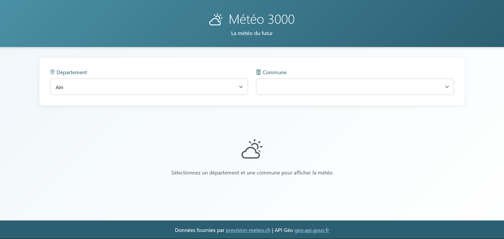
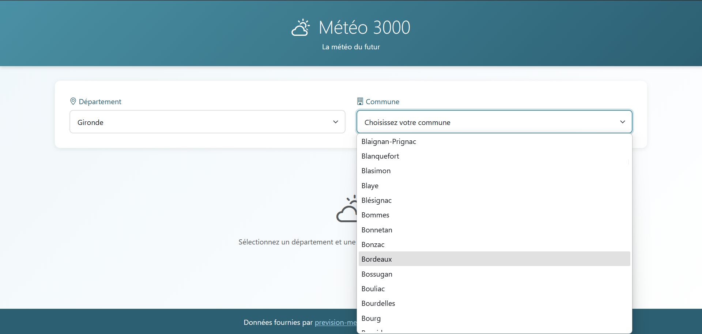
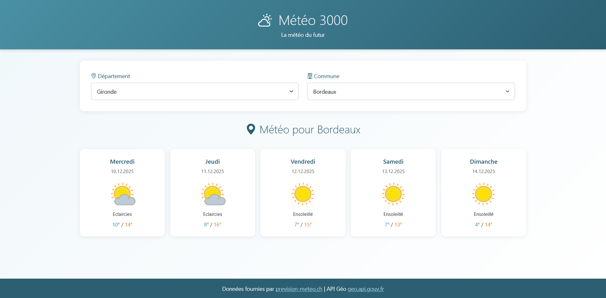

# ☁️ Météo 3000 - La météo du futur

Application web de prévisions météorologiques pour toutes les communes de France, développée en JavaScript vanilla avec consommation d'APIs REST.

## 🌐 Démo en ligne

👉 **[Voir l'application](https://thomasuzan.github.io/meteo3000/)**

## Fonctionnalités

- 🗺️ **Sélection géographique** : Tous les départements et communes de France
- 📅 **Prévisions sur 5 jours** : Météo détaillée jour par jour
- 🌡️ **Températures min/max** : Affichage clair des amplitudes thermiques
- 🎨 **Interface moderne** : Design épuré et agréable
- 📱 **Responsive** : Adapté mobile, tablette et desktop
- ⚡ **Temps réel** : Données actualisées via API

## Technologies utilisées

- **HTML5 / CSS3** - Structure et style
- **JavaScript ES6+** - Logique applicative
- **Bootstrap 5** - Framework CSS responsive
- **Fetch API** - Requêtes HTTP asynchrones
- **API Géo Gouv** - Données géographiques françaises
- **API Prevision-Meteo.ch** - Données météorologiques

## Captures d'écran

### Page d'accueil


### Sélection département et commune


### Affichage des prévisions météo


## Installation en local

1. Cloner le repository
```bash
git clone https://github.com/VOTRE_USERNAME/meteo3000.git
```

2. Ouvrir le fichier `index.html` dans un navigateur

> ℹ️ Aucune installation requise, l'application fonctionne directement dans le navigateur !

## Structure du projet

```
meteo3000/
├── index.html          # Page principale
├── js/
│   ├── script.js       # Gestion des sélecteurs (départements/communes)
│   └── meteo.js        # Appel API météo et affichage
├── screenshots/        # Captures d'écran
└── README.md
```

## APIs utilisées

| API | Usage | Documentation |
|-----|-------|---------------|
| Geo API Gouv | Liste des départements et communes | [geo.api.gouv.fr](https://geo.api.gouv.fr/) |
| Prevision-Meteo.ch | Données météorologiques | [prevision-meteo.ch](https://www.prevision-meteo.ch/) |

## Fonctionnement

1. L'utilisateur sélectionne un **département** → l'API Géo récupère les communes
2. L'utilisateur sélectionne une **commune** → l'API Météo récupère les prévisions
3. Les données sont affichées sous forme de **cartes** pour chaque jour

## Auteur

Développé par **Thomas UZAN** dans le cadre d'une formation DWWM.

- 🌐 Portfolio : [thomasuzan.fr](https://thomasuzan.fr)
- 💼 LinkedIn : [linkedin.com/in/thomas-uzan](https://www.linkedin.com/in/thomas-uzan/)